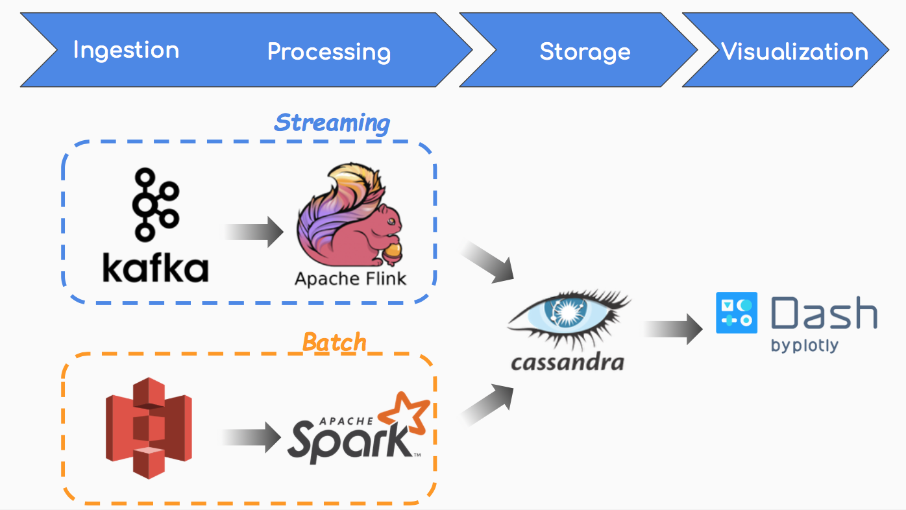

# Wiki-Guardian:  *"Catch every Anomaly for you"*

Insight 2018 Data Engineering Project

## Project Summary:

This data pipeline is designed and implemented for real-time detection of user anomaly in streaming Wikipedia edit log.

## Project Description:

Changing and editing on existing topics are extrem common and quite often, especially from core group of user who like to engage more. This project aims to provide an analytic tool for wikipedia to ingest the core user behavier and suggest peer-review candidates for submitted revision.

Use Case:

1. Possible Fraud Usage Detection: Abnormal behavior of Wiki articles modification should be flagged on:

	1. No. of modification per minute from SAME user;
	
		flag the user: edit multiple articles in very short time window;

	2. No. of modification per minute SAME article received;  
	
		flag the article: been edited too frequently in very short time window;

2. Peer Review Candidates Suggestion: 

	For flagged articles, system need to provide peer-review candidates who: either has similar interest as this user; or has edit this article/catogary most time.

3. Web activity monitoring:

	check the most modified articles;

	check the most active user;
	
	

## Live Demo

## Architecture

## Input Data:

1. The wikipedia edit log contains fields: `REVISION`,  `article_id`, `rev_id`,  `article_title`, `timestamp`,  `username`,  `user_id`. An example is shown below:
   > REVISION 4781981 72390319 Steven_Strogatz 2006-08-28T14:11:16Z SmackBot 433328 

   
2. The uncompressed dataset is about several TB which can be downloaded from [wikipedia site](https://en.wikipedia.org/wiki/Wikipedia:Database_download);
3. The data set contains fields of "user_id", "Edit time", "article", "category";

## Version:

1. Kafka: 1.0.0
2. Flink: 1.4.0
3. Spark: 2.2.1
4. Cassandra: 3.11.2
5. Dash: 0.21.1
6. Hadoop: 2.7.6
7. Zookeeper: 3.4.10

